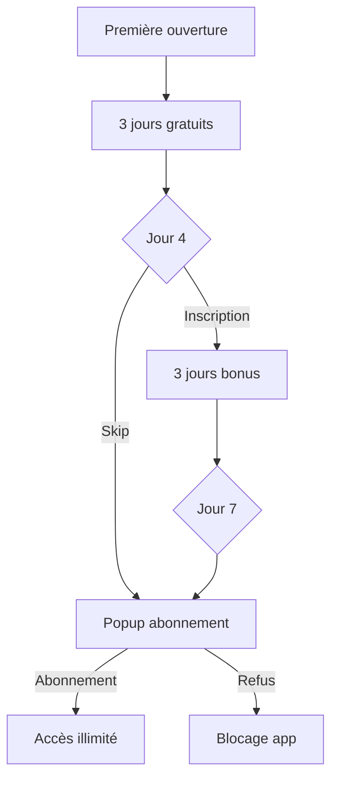

# 💰 Système de Paywall - UPGLOW

## 📋 Vue d'ensemble

UPGLOW utilise un système de paywall avec période d'essai gratuite pour monétiser l'application.

### Modèle économique

- **Prix** : 6,99€/mois
- **Essai gratuit initial** : 3 jours sans inscription
- **Bonus d'inscription** : 3 jours supplémentaires gratuits
- **Total possible gratuit** : 6 jours

## 🎯 Fonctionnement

### Phase 1 : Jours 1-3 (Essai gratuit)
- ✅ Accès complet à l'application
- ✅ Aucune inscription requise
- ✅ Badge "X jours gratuits" visible dans le dashboard
- 📊 Tracking automatique de la première ouverture

### Phase 2 : Jour 4 (Popup d'extension)
- 🎨 Popup avec Glowee qui propose l'inscription
- 💝 Message personnalisé : "C'est pour ton bien, je suis là pour toi !"
- 🎁 Offre : 3 jours supplémentaires gratuits
- 📝 Formulaire d'inscription (email + mot de passe)
- ⏭️ Option "Peut-être plus tard"

### Phase 3 : Après les jours gratuits (Popup d'abonnement)
- 👑 Popup premium avec Glowee
- 💎 Liste des avantages de l'abonnement
- 💳 Bouton d'abonnement à 6,99€/mois
- ❌ Blocage de l'accès à l'application

## 🛠️ Architecture technique

### Store (Zustand)

```typescript
interface SubscriptionState {
  firstOpenDate: string | null;        // Date de première ouverture
  hasRegistered: boolean;              // Utilisateur inscrit ?
  registrationDate: string | null;     // Date d'inscription
  isSubscribed: boolean;               // Abonnement actif ?
  subscriptionEndDate: string | null;  // Date de fin d'abonnement
  hasSeenTrialPopup: boolean;         // Popup vu ?
}
```

### Méthodes disponibles

- `initializeFirstOpen()` - Initialise la date de première ouverture
- `registerUser()` - Enregistre l'utilisateur (débloque 3 jours bonus)
- `subscribe(endDate)` - Active l'abonnement
- `unsubscribe()` - Désactive l'abonnement
- `getRemainingFreeDays()` - Calcule les jours gratuits restants
- `isTrialExpired()` - Vérifie si l'essai est expiré
- `canAccessApp()` - Vérifie si l'utilisateur peut accéder à l'app
- `markTrialPopupSeen()` - Marque le popup comme vu

### Composants

#### 1. `TrialExtensionPopup.tsx`
- Popup pour les 3 jours supplémentaires
- Formulaire d'inscription
- Image Glowee encourageante
- Design moderne avec gradients

#### 2. `SubscriptionPopup.tsx`
- Popup d'abonnement premium
- Liste des fonctionnalités
- Prix et CTA
- Image Glowee célébration

#### 3. `TrialBadge.tsx`
- Badge affichant les jours restants
- Badge "Premium" pour les abonnés
- Badge "Essai terminé" pour les expirés
- Visible dans le dashboard

## 🎨 Design

### Couleurs
- **Gratuit** : Rose/Pink (rose-100, rose-400)
- **Premium** : Jaune/Orange (yellow-400, orange-400)
- **Expiré** : Rouge (red-100, red-600)

### Images Glowee
- **Extension** : `/Glowee/glowee-encouragement.webp`
- **Abonnement** : `/Glowee/glowee-felicite.webp`

## 🔄 Flux utilisateur



## 📱 Intégrations futures

### À implémenter

1. **Firebase Authentication** ✅ Configuré
   - Inscription email/password
   - Connexion utilisateur
   - Récupération de mot de passe

2. **Système de paiement** 🔜 À faire
   - Stripe (recommandé)
   - PayPal
   - Apple Pay / Google Pay

3. **Backend** 🔜 À faire
   - Vérification des abonnements
   - Webhooks Stripe
   - Gestion des renouvellements

## 🧪 Tests

### Scénarios à tester

1. ✅ Première ouverture → Badge "3 jours gratuits"
2. ✅ Jour 4 → Popup d'extension apparaît
3. ✅ Inscription → Badge "6 jours gratuits"
4. ✅ Jour 7 → Popup d'abonnement
5. ✅ Abonnement → Badge "Premium"

### Réinitialiser les tests

Pour tester à nouveau le système :
1. Ouvrir les DevTools
2. Application → Local Storage
3. Supprimer la clé `glow-up-storage`
4. Recharger la page

## 📊 Métriques à suivre

- Taux de conversion inscription (jour 4)
- Taux de conversion abonnement (jour 7)
- Taux de rétention après inscription
- Revenu moyen par utilisateur (ARPU)
- Taux de désabonnement (churn)

## 🔐 Sécurité

- ✅ Données stockées localement (Zustand persist)
- ✅ Pas de données sensibles en clair
- 🔜 Validation côté serveur des abonnements
- 🔜 Protection contre la manipulation du localStorage

## 📝 Notes

- Le système actuel est **frontend-only**
- Les abonnements ne sont **pas encore vérifiés côté serveur**
- Firebase est configuré mais **pas encore utilisé pour l'auth**
- Le paiement est **simulé** pour l'instant

## 🚀 Prochaines étapes

1. Intégrer Firebase Authentication
2. Configurer Stripe pour les paiements
3. Créer un backend pour la vérification
4. Ajouter des webhooks Stripe
5. Implémenter la gestion des renouvellements
6. Ajouter des analytics pour suivre les conversions

